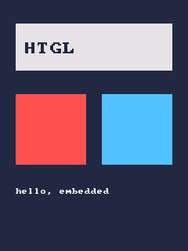
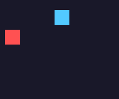
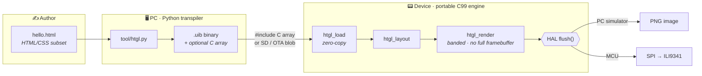
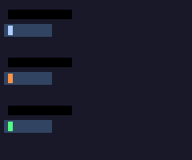
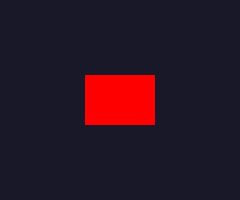
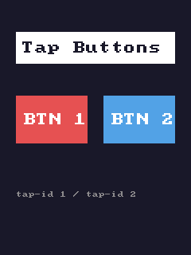

<div align="center">

# HTGL

**Write embedded UIs in HTML/CSS. Render them on a microcontroller.**

HTGL is an LVGL-style embedded UI framework — but instead of hand-coding widgets in C,
you author screens in an HTML/CSS subset, transpile them to a compact binary, and render
with a tiny portable C99 engine. The same `.html` previews in any browser.

[](LICENSE)


<br/>


&nbsp;&nbsp;


<sub>Left: <code>examples/hello.html</code> → static PNG &nbsp;·&nbsp; Right: declarative <code>data-anim</code> interpolated by <code>htgl_tick()</code> → GIF</sub>

</div>

---

## Why HTGL

- 🎨 **Author in HTML/CSS** — a subset everyone already knows, and you can open the file in a browser to preview it.
- 🪶 **Tiny & portable** — the engine is pure **C99** with **no mandatory heap** and a chunked renderer that never needs a full framebuffer, so it fits low-end MCUs (e.g. STM32F1, tens of KB RAM, no FPU). [Measured](#footprint--does-it-really-fit-a-low-end-mcu): **~2.6 KB flash + ~4 KB RAM** cross-compiled for Cortex-M3.
- 🔌 **HAL-decoupled** — the engine is platform-agnostic; only a `flush()` callback differs between the PC simulator and real hardware.
- 📦 **One binary, two ways to load** — the transpiler emits a compact `.uib` that you can either `#include` as a C array (zero runtime parsing) **or** load at runtime from SD/OTA (swap the UI without reflashing).
- 🎬 **Animation** — declare motion with `data-anim` and the engine interpolates it on a `htgl_tick(now_ms)` call (integer math, no FPU). CSS `@keyframes` support is on the way.

## How it works



The engine renders the screen in **horizontal bands** sized to a small line buffer, drawing only
what intersects each band and flushing it out — the same strategy LVGL uses to avoid holding a
full framebuffer in RAM. Porting to new hardware means implementing one `flush()` function.

## Example

`examples/hello.html` — ordinary HTML you can also open in a browser:

```html
<div style="position:absolute; left:0; top:0; width:240px; height:320px; background-color:#202840">
  <div style="position:absolute; left:20px; top:30px; width:200px; height:60px; background-color:#e0e0e0">
    <div style="position:absolute; left:12px; top:24px; color:#202840; font-size:16px">HTGL</div>
  </div>
  <div style="position:absolute; left:20px; top:120px; width:90px; height:90px; background-color:#ff5050"></div>
  <div style="position:absolute; left:130px; top:120px; width:90px; height:90px; background-color:#50c0ff"></div>
  <div style="position:absolute; left:20px; top:240px; color:#ffffff; font-size:8px">hello, embedded</div>
</div>
```

→ transpiles to a **199-byte** `.uib` → renders to the static image at the top of this README.

## Animation

Declare motion and the engine interpolates it when you call `htgl_tick(now_ms)` (integer-only, no FPU).
Two equivalent ways to author it:

**1. `data-anim` attribute** — compact, embedded-friendly:

```html
<div style="position:absolute; left:10px; top:60px; width:30px; height:30px; background-color:#ff5050"
     data-anim="x" data-from="10" data-to="200" data-dur="1000" data-loop="pingpong" data-ease="ease-out"></div>
```

**2. CSS `@keyframes` + `animation`** — the *same file also animates in a browser*:

```html
<style>@keyframes slide { from { left: 10px } to { left: 200px } }</style>
<div style="position:absolute; left:10px; top:60px; width:30px; height:30px; background-color:#ff5050;
            animation: slide 1s infinite alternate ease-out"></div>
```

Both compile to **byte-identical** animation records.

- property: `x` · `y` · `w` · `h` · `bg` (background color — interpolated per RGB channel)
- loop: `once` (clamp) · `loop` (restart) · `pingpong` (reverse each pass)
- easing: `linear` · `ease-in` · `ease-out` · `ease-in-out` (integer quadratic curves)

<div align="center">

&nbsp;

</div>

<sub>Left: three easing curves (ease-out leads, linear middle, ease-in lags). Right: <code>bg</code> animation — red↔blue blended per channel.</sub>

Render a timeline to frames with `htgl_sim in.uib out_prefix <frames> <total_ms>`, then stitch a GIF
(see `demos/`).

## Touch input

Make a `<div>` tappable with `data-tap="<1..255>"`. Feed pointer events to the engine and register a
handler — it hit-tests the topmost button and fires its id to your application code:

```c
htgl_set_tap_handler(&ctx, on_tap, NULL);   /* void on_tap(int id, void *user) */
htgl_pointer_down(&ctx, x, y);
htgl_pointer_up(&ctx, x, y);                 /* fires on_tap(id) if press+release hit the same button */
```

<div align="center"></div>

## Run on hardware — ESP32 + ST7789

A ready PlatformIO port lives in [`port/esp32/`](port/esp32/) and **compiles out of the box**
(`esp32dev`, ~26% flash / ~10% RAM). The UI is embedded as a C array (no SD card needed), animation
runs via `htgl_tick(millis())` each loop, and the display backend is a one-line TFT_eSPI `flush()`.

```sh
# edit the SPI pins / panel size in port/esp32/platformio.ini, then:
pio run -d port/esp32            # compile
pio run -d port/esp32 -t upload  # flash, then: pio device monitor
```

Porting to another MCU/display = implement one `flush(x,y,w,h,rgb565)`; the engine is unchanged.

## Footprint — does it really fit a low-end MCU?

The engine is platform-independent C99, so we can cross-compile it for the thesis target
(**STM32F1 = Cortex-M3**) and *measure* — no hardware needed. Reproduce with
[`scripts/measure_footprint.sh`](scripts/measure_footprint.sh) (needs `arm-none-eabi-gcc`):

```sh
sh scripts/measure_footprint.sh        # defaults to cortex-m3
```

| What | Size | Where |
|---|---:|---|
| Engine code + 8×8 font (`htgl.c` + `draw.c`) | **2.6 KB** | flash (`.text` / `.rodata`) |
| Engine static RAM | **0 B** | — (no global state) |
| Per-UI context (`htgl_ctx`, `HTGL_MAX_NODES=256`) | **3.6 KB** | RAM (`.bss`, caller-allocated) |
| Line buffer (caller-owned) | `screen_w × rows × 2 B` | RAM — e.g. 240×1 row = **480 B** |

Measured with `arm-none-eabi-gcc 13.3.0 -mcpu=cortex-m3 -Os`. A 240-px-wide UI needs
**~2.6 KB flash + ~4 KB RAM** total — about 20 % of an STM32F103's 20 KB SRAM, leaving the
rest for your application. The font is `const` (lives in flash, not RAM); per-context RAM
scales with `HTGL_MAX_NODES` and can be lowered for tighter parts.

## The `.uib` binary format

A flat, little-endian, zero-copy layout. Compile-time and runtime loading share the exact same bytes.

| Section | Size | Contents |
|---|---|---|
| **Header** | 16 B | magic `HTGL`, version, node count, screen W/H, string-table offset, anim count |
| **Node[]** | 18 B each | type (`SCREEN`/`BOX`/`TEXT`), parent index, x/y/w/h, bg/fg (RGB565), font scale, text ref |
| **Anim[]** | 10 B each | node index, prop (x/y/w/h), mode (loop + easing, packed), from/to, duration (ms) |
| **String table** | var | length-prefixed ASCII for text nodes |

Animation-free blobs carry `anim count = 0` and an empty `Anim[]`, so they stay byte-identical to the original format.

## Prerequisites

- **Python 3** with `pytest` (transpiler + its tests)
- A **C99 compiler** and **CMake** (engine + simulator)
- `sh` (used by the end-to-end test)

> On Windows with MSYS2, ensure the MinGW toolchain is on `PATH` and select the generator
> explicitly: `cmake -S . -B build -G "MinGW Makefiles"`. On Linux/macOS the default generator works as-is.

## Build & run the host simulator

```sh
# 1. transpile the example to a .uib binary
cd tool && python htgl.py ../examples/hello.html -o ../build/hello.uib && cd ..

# 2. build the engine + simulator
cmake -S . -B build && cmake --build build

# 3. render to a PNG (use ./build/htgl_sim.exe on Windows)
./build/htgl_sim build/hello.uib build/hello.png
```

## Test

```sh
cd tool && python -m pytest      # transpiler (91 tests)
ctest --test-dir build           # engine + end-to-end golden image (8 suites)
```

## Project structure

```
htgl/
├── tool/            Python transpiler:  HTML/CSS subset → .uib (+ C array)
│   └── htgl/        colors · css · cssanim · html_tree · uib · emitc · cli
├── engine/          Portable C99 engine (no platform code)
│   ├── htgl.c       load / layout / banded render
│   ├── draw.c       rect + bitmap-font rasterization
│   └── *.h          public API + internal layout
├── port/
│   ├── sim/         Host backend: flush() → PNG
│   └── esp32/       ESP32 + ST7789 (TFT_eSPI) PlatformIO project
├── examples/        hello.html
├── tests/           C unit tests + golden .uib / .png
└── docs/            design spec + implementation plans
```

## Roadmap

| Milestone | Scope | Status |
|---|---|---|
| **M1** | HTML → `.uib` → host simulator → PNG (vertical slice) | ✅ complete |
| **Anim P1** | `data-anim` declarative animation + `htgl_tick` runtime | ✅ complete |
| **Anim P2** | CSS `@keyframes`/`animation` subset → same runtime | ✅ complete |
| **Anim P3** | Easing curves (linear/ease-in/ease-out/ease-in-out) | ✅ complete |
| **Anim P4** | Background-color animation (per-channel) | ✅ complete |
| **Touch** | Tap input subsystem (hit-test + callback) | ✅ complete |
| **ESP32** | ESP32 + ST7789 port (TFT_eSPI), compiles | ✅ complete |
| **M2** | STM32F1 + ILI9341 port (new `flush()`), engine core unchanged | 🔜 |
| **M3** | Images + on-screen widgets (sliders, lists) | 🔜 |
| **M4** | Flex/percent layout (fixed-point), easing curves | 🔜 |
| **M5** | Runtime `.uib` from SD/OTA, multi-font/UTF-8, browser live preview | 🔜 |

Design and per-milestone plans live under [`docs/superpowers/`](docs/superpowers/).

## License

[MIT](LICENSE) — free for commercial and embedded use.
